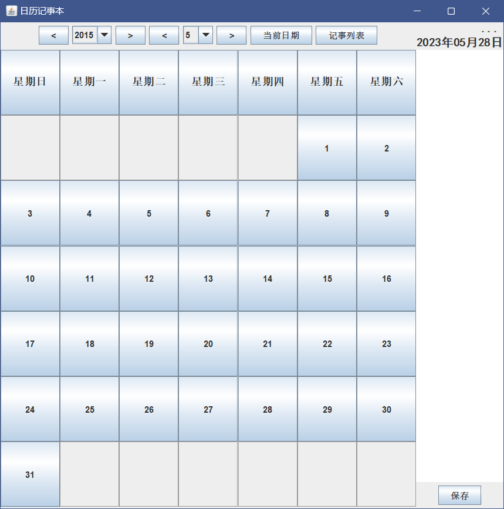

# java大作业

### 二.题目

**具有每日记账功能的简易日历程序**

要求：编写具有图形用户界面（GUI）的日历组件显示日期和时间并进行适当的功能扩充。

主要功能：

1、显示当月日历，当前日期、当前时间；

2、可查询任意月以及任意年的日历；

3、正常运行和退出程序。

4、每日具有记账功能，需要至少包含1）记账id；2）记账类型；2）支出费用；3）关键字（关键字写为一行，关键字数量不限，使用分号分割<需查阅使用>）

5、能够通过关键字查询某一种类型的记账记录。

6、对当月记账类型的汇总；对特定关键字的记账汇总。

### 三.代码分析

1).获取当月的天数

```java
 public static int getDays(int year, int month) {// 获取某年某月的天数
        int days = 0;
        if (month == 1 || month == 3 || month == 5 || month == 7 || month == 8 || month == 10 || month == 12) {
            days = 31;
        } else if (month == 4 || month == 6 || month == 9 || month == 11) {
            days = 30;
        } else if (month == 2) {
            if (year % 4 == 0 || year % 400 == 0 && year % 100 != 0) {
                days = 29;
            } else {
                days = 28;
            }
        }
        return days;
    }
```

2).日历界面,并通过卡片布局器切换界面

```
  //添加星期栏
        for (int i = 0; i < week.length; i++) {
            weekButton[i] = new JButton(week[i]);
            // weekButton[i].setBackground(Color.white);
            // weekButton[i].setForeground(Color.black);
            weekButton[i].setEnabled(false);//星期不可点击
            calenderPanel.add(weekButton[i]);
        }
        //添加天数按钮
        for (int i = 0; i < 42; i++) {
            dayButton[i] = new JButton();
            // dayButton[i].setText("");
            // dayButton[i].addActionListener(this);
            calenderPanel.add(dayButton[i]);
        }
```

3).记账界面

```java
//记事本文本区域
        textArea = new JTextArea(50, 50);
        textArea.setLineWrap(true);//
        textArea.setWrapStyleWord(true);
        textArea.setBorder(BorderFactory.createLineBorder(Color.black));
        // textArea.setBackground(Color.white);
        // textArea.setForeground(Color.black);
        textArea.setFont(new Font("宋体", Font.PLAIN, 20));
        saveButton = new JButton("保存");
        saveButton.addActionListener(this);
        delButton = new JButton("删除");
        delButton.addActionListener(this);
        JPanel textPanel = new JPanel();
        textPanel.setLayout(new FlowLayout());
        textPanel.add(saveButton);
        textPanel.add(delButton);
        JPanel notePanel = new JPanel();
        notePanel.setLayout(new BorderLayout());
        notePanel.add(textArea, BorderLayout.CENTER);
        notePanel.add(dateLabel, BorderLayout.NORTH);
        logPanel.add(notePanel, BorderLayout.CENTER);
        logPanel.add(textPanel, BorderLayout.SOUTH);
        container.add(logPanel);//添加记事面板
```

4).相关按钮设置

```java
        preYear = new JButton("<<");
        preYear.addActionListener(this);
        preMonth = new JButton("<");
        preMonth.addActionListener(this);
        nextYear = new JButton(">>");
        nextYear.addActionListener(this);
        nextMonth = new JButton(">");
        nextMonth.addActionListener(this);
        goTODAY = new JButton("回到今天");
        goTODAY.addActionListener(this);
        Notelist = new JButton("记账记录");
        Notelist.addActionListener(this);
        JPanel datePanel = new JPanel();
        datePanel.setLayout(new FlowLayout());
        datePanel.add(preYear);
        datePanel.add(preMonth);
        datePanel.add(yearBox);
        datePanel.add(monthBox);
        datePanel.add(nextMonth);
        datePanel.add(nextYear);
        datePanel.add(goTODAY);
        datePanel.add(Notelist);
```

4).记账保存

```java
 String date = dateLabel.getText();
            if (date.equals("_")) {
                JOptionPane.showMessageDialog(null, "请选择日期");
            } else {
                String content = textArea.getText();
                if (content.equals("")) {
                    JOptionPane.showMessageDialog(null, "请输入内容");
                } else {
                    try {
                        File file = new File("E://codebase//test//" + date + ".txt");
                        if (!file.getParentFile().exists()) {
                            file.getParentFile().mkdirs();
                        }
                        file.createNewFile();
                        FileWriter fw = new FileWriter(file);
                        fw.write(content);
                        fw.close();
                        JOptionPane.showMessageDialog(null, "保存成功");
                        textArea.setText("");
                    } catch (Exception e1) {
                        JOptionPane.showMessageDialog(null, "保存失败");
                    }
                }
            }
        }
```


### 四.执行结果

1).代码段

```java
import java.awt.*;
import java.awt.event.*;
import java.io.BufferedReader;
import java.io.File;
import java.io.FileReader;
import java.io.FileWriter;
import java.text.SimpleDateFormat;
import java.util.Calendar;
import java.util.Date;
import java.util.TimerTask;
import java.util.Timer;

import javax.swing.*;
import javax.swing.table.DefaultTableModel;
import javax.swing.table.TableRowSorter;

public class CalenderNotePad extends JFrame implements ActionListener {
    private static final long serialVersionUID = 1L;
    private static final int WIDTH = 700;
    private static final int HEIGHT = 700;
    private static final int NUM_ROWS = 7;
    private static final int NUM_COLS = 7;
    // private static final int MARGIN = 10;
    private JFrame jframe;// = new JFrame();
    private JButton[] weekButton = new JButton[7];// 星期数
    private JButton[] dayButton = new JButton[42];// 点击到的日期
    private String week[] = {"星期日", "星期一", "星期二", "星期三", "星期四", "星期五", "星期六"};
    private String years[] = {"2020", "2021", "2022", "2023", "2024", "2025", "2026", "2027", "2028", "2029", "2030",
            "2031", "2032"};
    private String months[] = {"1", "2", "3", "4", "5", "6", "7", "8", "9", "10", "11", "12"};
    // private int year, month, day;// 年月日
    private int chosenYear, chosenMonth;// 选择的年月
    private JLabel timeLabel, dateLabel;// 时间标签和日期标签
    private JTextArea textArea;// 记事本文本区
    private JTable table;// 表格,用于展示记录日志
    private CardLayout cardLayout;// 卡片
    private Container container;// 容器
    private JScrollPane scrollPane;// 滚动条
    private DefaultTableModel model;// 表格模型
    private int recordMonth, recordYear;// 记录的月份和年份框值索引
    // 打算用getContentPane()方法获得JFrame的内容面板，再对其加入组件
    private SimpleDateFormat sdf = new SimpleDateFormat("yyyy-MM-dd HH:mm:ss");// 时间格式
    // 获取系统当前日期
    // public void getCurrentDate(){
    // java.util.Date date=new java.util.Date();
    // year=date.getYear()+1900;
    // month=date.getMonth()+1;
    // day=date.getDate();
    // }
    private boolean isNotePad = false,isFristIn=true;// 是否是记事本页面
    private JPanel menupPanel, calenderPanel, logPanel;// 记事本面板和日志面板
    private JPanel cardPanel;// 卡片面板
    private JButton preYear, preMonth, nextYear, nextMonth, goTODAY, Notelist, saveButton, delButton;// 前一年、前一月、下一年、下一月按钮
    private JComboBox yearBox, monthBox;// 年份下拉框、月份下拉框
    private int noteCount=0;

    public CalenderNotePad() {

        jframe = new JFrame();
        jframe.setTitle("日历");
        jframe.setSize(WIDTH, HEIGHT);
        jframe.setDefaultCloseOperation(JFrame.EXIT_ON_CLOSE);
        jframe.setLayout(new BorderLayout());
        jframe.setVisible(true);
        container = jframe.getContentPane();
        //制作日历面板
        menupPanel = new JPanel();//菜单栏面板
        menupPanel.setLayout(new BorderLayout());
        calenderPanel = new JPanel();
        calenderPanel.setLayout(new GridLayout(NUM_ROWS, NUM_COLS));
        // //制作时间面板
        // JPanel timePanel=new JPanel();
        // timePanel.setLayout(new BorderLayout());
        // //制作记事本面板
        // JPanel textPanel=new JPanel();
        // textPanel.setLayout(new BorderLayout());
        // //制作表格面板
        // JPanel tablePanel=new JPanel();
        // tablePanel.setLayout(new BorderLayout());
        // //制作卡片布局
        // cardLayout=new CardLayout();
        // container.add(calenderPanel,"calender");
        // container.add(timePanel,"time");
        // container.add(textPanel,"text");
        // container.add(tablePanel,"table");
        // container.setVisible(true);
        // //制作日历面板
        //添加星期栏
        for (int i = 0; i < week.length; i++) {
            weekButton[i] = new JButton(week[i]);
            // weekButton[i].setBackground(Color.white);
            // weekButton[i].setForeground(Color.black);
            weekButton[i].setEnabled(false);//星期不可点击
            calenderPanel.add(weekButton[i]);
        }
        //添加天数按钮
        for (int i = 0; i < 42; i++) {
            dayButton[i] = new JButton();
            // dayButton[i].setText("");
            // dayButton[i].addActionListener(this);
            calenderPanel.add(dayButton[i]);
        }
        //制作记事本表格展示面板
        String columnNames[] = {"记账id", "日期", "支出费用及关键字"};
        model = new DefaultTableModel(columnNames, 0);
        table = new JTable(model);
        table.setRowSorter(new TableRowSorter<>(model));
        scrollPane = new JScrollPane(table);
        // scrollPane.setPreferredSize(new Dimension(500, 200));
        //使用卡片布局来切换面板
        cardLayout = new CardLayout();
        cardPanel = new JPanel(cardLayout);
        cardPanel.add(calenderPanel, "calender");
        cardPanel.add(scrollPane, "table");
        menupPanel.add(cardPanel, BorderLayout.CENTER);
        //制作菜单栏面板
        //下拉框
        yearBox = new JComboBox<>(years);//年份下拉框
        yearBox.setEditable(false);
        /*
        // yearBox.addActionListener(listener -> {
        //     chosenYear = Integer.parseInt(yearBox.getSelectedItem().toString());
        //     showCalender(chosenYear, chosenMonth);
        // });
        */
        yearBox.addActionListener(e -> getChosenDate());//监听年份下拉框
        monthBox = new JComboBox<>(months);//月份下拉框
        monthBox.setEditable(false);
        monthBox.addActionListener(e -> getChosenDate());

        //初始化日历的开始日期
        Calendar calendar = Calendar.getInstance();
        calendar.set(calendar.get(Calendar.YEAR), calendar.get(Calendar.MONTH), 1);//设置日期为当月第一天
        int firstDayOfWeek = calendar.get(Calendar.DAY_OF_WEEK) - 1;//获取当月第一天是星期几
        for (int i = 1; i <= getDays(calendar.get(Calendar.YEAR), calendar.get(Calendar.MONTH) + 1); i++) {
            dayButton[firstDayOfWeek].setText("" + i + "");
            firstDayOfWeek++;
        }
        for (int i = 0; i < years.length; i++) {
            String currentYear = String.valueOf(calendar.get(Calendar.YEAR));
            if (years[i].equals(currentYear)) {
                yearBox.setSelectedIndex(i);
            }
        }
        monthBox.setSelectedIndex(calendar.get(Calendar.MONTH));

        //按钮
        preYear = new JButton("<<");
        preYear.addActionListener(this);
        preMonth = new JButton("<");
        preMonth.addActionListener(this);
        nextYear = new JButton(">>");
        nextYear.addActionListener(this);
        nextMonth = new JButton(">");
        nextMonth.addActionListener(this);
        goTODAY = new JButton("回到今天");
        goTODAY.addActionListener(this);
        Notelist = new JButton("记账记录");
        Notelist.addActionListener(this);
        JPanel datePanel = new JPanel();
        datePanel.setLayout(new FlowLayout());
        datePanel.add(preYear);
        datePanel.add(preMonth);
        datePanel.add(yearBox);
        datePanel.add(monthBox);
        datePanel.add(nextMonth);
        datePanel.add(nextYear);
        datePanel.add(goTODAY);
        datePanel.add(Notelist);
        menupPanel.add(datePanel, BorderLayout.NORTH);//添加日期面板
        container.add(menupPanel, BorderLayout.WEST);//添加菜单面板
        //当前时间标签
        timeLabel = new JLabel();
        /*
//        timer.schedule(new TimerTask() {
//            @Override//有点小问题
//            public void run() {
//                timeLabel.setText(new SimpleDateFormat("yyyy年MM月dd日 HH:mm:ss").format(new Date()));
//            }
//        }, 0, 1000);//绝对有问题!!!*/
        Timer timer = new Timer();
        TimerTask task = new TimerTask() {//设置定时器，在界面中显示时间
            @Override
            public void run() {
                long timemillis = System.currentTimeMillis();
                //转换日期显示格式
                SimpleDateFormat df = new SimpleDateFormat("yyyy年MM月dd日      HH:mm:ss  E");
                timeLabel.setText("  当前时间(-_-):" + df.format(new Date(timemillis)));
            }
        };
        timer.schedule(task, 1000, 1000);//每过一秒
        Font font = new Font("宋体", Font.BOLD, 15);
        logPanel = new JPanel();
        logPanel.setLayout(new BorderLayout());
        logPanel.add(timeLabel, BorderLayout.NORTH);//添加时间标签
        //记事的日期
        dateLabel = new JLabel();
        dateLabel = new JLabel(" ", JLabel.CENTER);
        dateLabel.setFont(font);
        dateLabel.setText(new SimpleDateFormat("yyyy年MM月dd日").format(new Date()));

        //记事本文本区域
        textArea = new JTextArea(50, 50);
        textArea.setLineWrap(true);//
        textArea.setWrapStyleWord(true);
        textArea.setBorder(BorderFactory.createLineBorder(Color.black));
        // textArea.setBackground(Color.white);
        // textArea.setForeground(Color.black);
        textArea.setFont(new Font("宋体", Font.PLAIN, 20));
        saveButton = new JButton("保存");
        saveButton.addActionListener(this);
        delButton = new JButton("删除");
        delButton.addActionListener(this);
        JPanel textPanel = new JPanel();
        textPanel.setLayout(new FlowLayout());
        textPanel.add(saveButton);
        textPanel.add(delButton);
        JPanel notePanel = new JPanel();
        notePanel.setLayout(new BorderLayout());
        notePanel.add(textArea, BorderLayout.CENTER);
        notePanel.add(dateLabel, BorderLayout.NORTH);
        logPanel.add(notePanel, BorderLayout.CENTER);
        logPanel.add(textPanel, BorderLayout.SOUTH);
        container.add(logPanel);//添加记事面板
    }

    // 这里面太坑了
    // Calendar.DATE是一个固定的,还是要把calendar传入进来获取DATE属性
    public void getChosenDate() {// 获取选择的日期
        for (int i = 0; i < dayButton.length; i++) {
            dayButton[i].setBackground(null);
            dayButton[i].setText("");
            dayButton[i].setEnabled(false);
        }
        Calendar calendar = Calendar.getInstance();// 获取当前日期
        chosenYear = Integer.parseInt(yearBox.getSelectedItem().toString());
        chosenMonth = Integer.parseInt(monthBox.getSelectedItem().toString());
        calendar.set(chosenYear, chosenMonth - 1, 1);// 设置日期
        int dayOfWeek = calendar.get(Calendar.DAY_OF_WEEK) - 1;// 获取当前日期是星期几
        for (int i = 1; i <= getDays(chosenYear, chosenMonth); i++) {
            dayButton[dayOfWeek].setText(String.valueOf(i));
            dayButton[dayOfWeek].setEnabled(true);
            dayButton[dayOfWeek].addMouseListener(new MyAdapter(dayButton[dayOfWeek]));
            // dayButton[dayOfWeek].setBackground(Color.white);
            dayButton[dayOfWeek].addActionListener(new dateReset(dayButton[dayOfWeek], dayOfWeek));
            dayOfWeek++;
        }
        recordMonth = monthBox.getSelectedIndex();
        recordYear = yearBox.getSelectedIndex();// 获取选择的年份和月份也是查找的索引

    }

    class MyAdapter extends MouseAdapter {
        JButton button;

        public MyAdapter(JButton button) {
            this.button = button;
        }

        // public void mouseClicked(MouseEvent e) {
        // if (e.getClickCount() == 2) {
        // button.setBackground(Color.white);
        // button.setText("");
        // button.setEnabled(false);
        // }
        // }
        public void mouseEntered(MouseEvent e) {// 鼠标进入按钮
            if (!button.getText().equals("")) {
                button.setBackground(Color.white);
            } else {
                button.setBackground(Color.lightGray);
            }
            // button.setText("");
            // button.setEnabled(false);
        }

        public void mouseExited(MouseEvent e) {// 鼠标离开按钮
            button.setBackground(null);
            // button.setText("");
            // button.setEnabled(false);
        }
    }

    class dateReset implements ActionListener {
        private JButton button;
        private int day;

        public dateReset(JButton button, int day) {
            this.button = button;
            this.day = day;
        }

        @Override
        public void actionPerformed(ActionEvent e) {
            chosenYear = Integer.parseInt(yearBox.getSelectedItem().toString());
            chosenMonth = Integer.parseInt(monthBox.getSelectedItem().toString());
            dateLabel.setText(chosenYear + "年" + chosenMonth + "月" + button.getText() + "日");// 希望点击了能够回显日期覆盖当前日期
        }
    }

    public static int getDays(int year, int month) {// 获取某年某月的天数
        int days = 0;
        if (month == 1 || month == 3 || month == 5 || month == 7 || month == 8 || month == 10 || month == 12) {
            days = 31;
        } else if (month == 4 || month == 6 || month == 9 || month == 11) {
            days = 30;
        } else if (month == 2) {
            if (year % 4 == 0 || year % 400 == 0 && year % 100 != 0) {
                days = 29;
            } else {
                days = 28;
            }
        }
        return days;
    }

    @Override
    public void actionPerformed(ActionEvent e) {
        if (e.getSource() == preYear) {
            recordYear--;
            if (recordYear >= 0) {
                yearBox.setSelectedIndex(recordYear);
            }
            if (recordYear < 0) {//如果年份小于0,则年份设置为最大值
                //   recordYear=0;
                yearBox.setSelectedIndex(yearBox.getItemCount() - 1);
            }
        }
        if (e.getSource() == nextYear) {
            recordYear++;
            if (recordYear < yearBox.getItemCount()) {
                yearBox.setSelectedIndex(recordYear);
            }
            if (recordYear >= yearBox.getItemCount()) {//如果年份大于最大值,则年份设置为最小值
                yearBox.setSelectedIndex(0);
            }
        }
        if (e.getSource() == preMonth) {
            recordMonth--;
            if (recordMonth >= 0) {
                monthBox.setSelectedIndex(recordMonth);
            }
            if (recordMonth < 0) {//如果月份小于0,则月份设置为最大值
                monthBox.setSelectedIndex(monthBox.getItemCount() - 1);
                yearBox.setSelectedIndex(recordYear - 1);
            }
        }
        if (e.getSource() == nextMonth) {
            recordMonth++;
            if (recordMonth < monthBox.getItemCount()) {
                monthBox.setSelectedIndex(recordMonth);
            }
            if (recordMonth >= monthBox.getItemCount()) {//如果月份大于最大值,则月份设置为最小值
                monthBox.setSelectedIndex(0);
                yearBox.setSelectedIndex(recordYear + 1);
                getChosenDate();
            }
        }
        if (e.getSource() == goTODAY) {
            Calendar calendar = Calendar.getInstance();// 获取当前日期
            dateLabel.setText(sdf.format(new Date()));
            for (int i = 0; i < dayButton.length; i++) {
                dayButton[i].setText("");
                // dayButton[i].setEnabled(false);
                // dayButton[i].setBackground(null);
            }
            calendar = Calendar.getInstance();// 获取当前日期
            String year = String.valueOf(calendar.get(Calendar.YEAR));
            for (int i = 0; i < years.length; i++) {
                if (yearBox.getItemAt(i).equals(year)) {
                    yearBox.setSelectedIndex(i);
                }
            }
            calendar.set(calendar.get(Calendar.YEAR), calendar.get(Calendar.MONTH), 1);
            monthBox.setSelectedIndex(calendar.get(Calendar.MONTH));//将月份框设置为当前日期的月份
        }
        if (e.getSource() == Notelist) {
            try {
                if (isNotePad) {
                    cardLayout.show(cardPanel, "calendar");
                    isNotePad = false;
                    if (!isFristIn) {
                        noteCount = 0;
                        while (model.getRowCount() > 0) {
                            System.out.println(model.getRowCount());
                            model.removeRow(model.getRowCount() - 1);
                        }
                    }
                } else {
                    cardLayout.show(cardPanel, "table");
                    isNotePad = true;
                    String note, noteTime;
                    File file = new File("E://codebase//test//");
                    File[] files = file.listFiles();
                    for (int i = 0; i < files.length; i++) {
                        if (files[i].isFile()) {
                            noteCount++;
                            noteTime = files[i].getName();
                            FileReader fr = new FileReader(files[i]);
                            BufferedReader br = new BufferedReader(fr);
                            note = br.readLine();
                            model.addRow(new Object[]{String.valueOf(noteCount), noteTime, note});
                            br.close();
                            fr.close();
                        }
                    }
                    isFristIn = false;
                }
            } catch (Exception e1) {
                e1.printStackTrace();
            }
        }
        if(e.getSource()==delButton)
        {try{
            File file = new File("E://codebase//test//"+model.getValueAt(table.getSelectedRow(), 1).toString());
            if(file.exists())
            {
                int r=JOptionPane.showInternalConfirmDialog(container, "确认删除吗？","提示框",JOptionPane.YES_NO_OPTION);
                if(r==0){
                    file.delete();
                    textArea.setText("");
                }
            }
        } catch (Exception e1) {
            e1.printStackTrace();
        }
        }
        if (e.getSource() == saveButton) {
            String date = dateLabel.getText();
            if (date.equals("_")) {
                JOptionPane.showMessageDialog(null, "请选择日期");
            } else {
                String content = textArea.getText();
                if (content.equals("")) {
                    JOptionPane.showMessageDialog(null, "请输入内容");
                } else {
                    try {
                        File file = new File("E://codebase//test//" + date + ".txt");
                        if (!file.getParentFile().exists()) {
                            file.getParentFile().mkdirs();
                        }
                        file.createNewFile();
                        FileWriter fw = new FileWriter(file);
                        fw.write(content);
                        fw.close();
                        JOptionPane.showMessageDialog(null, "保存成功");
                        textArea.setText("");
                    } catch (Exception e1) {
                        JOptionPane.showMessageDialog(null, "保存失败");
                    }
                }
            }
        }
    }


    public static void main(String[] args) {
        new CalenderNotePad();
    }
}
```

2).功能实现展示

1.主要UI界面可以显示当月日历，当前日期、当前时间；	



### 五.存在的问题

1.切换入记事本记录页后无法切换回来